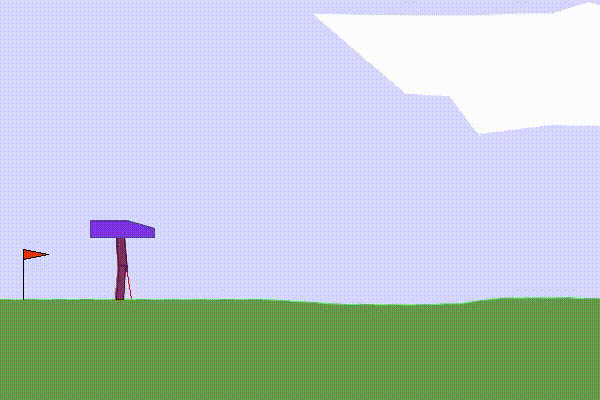
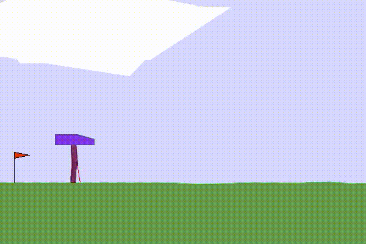
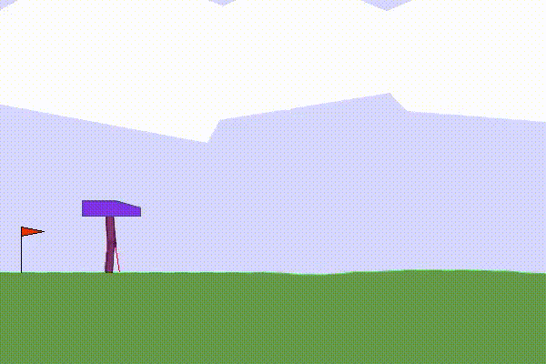
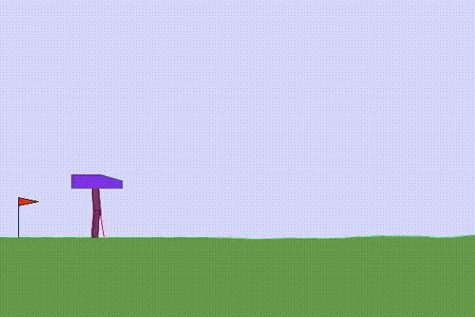
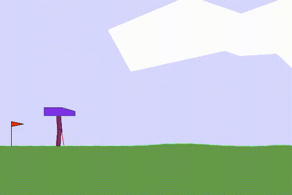

# DRL_project_Bipedal-Walker
PPO training using Gymnasium
# Bipedal Walker Reinforcement Learning Project

This project focuses on training a BipedalWalker-v3 agent using Reinforcement Learning with the PPO (Proximal Policy Optimization) algorithm from Stable-Baselines3.

The agent was trained in a continuous control environment provided by Gymnasium and learned how to balance and walk using two legs through trial-and-error interaction with the environment.

## Environment: BipedalWalker-v3

BipedalWalker-v3 is a continuous action environment based on Box2D physics simulation.

### Environment Features
- Two-legged walking robot
- Continuous action space
- Terrain-based movement
- Physics-based simulation

### Challenges
- Maintaining balance while walking
- Avoiding falls
- Learning smooth movement
- Coordinating both legs simultaneously

## Technologies Used

- Python
- Gymnasium
- Stable-Baselines3
- PPO Algorithm
- Reinforcement Learning
- Google Colab

## Environment Normalization

VecNormalize from Stable-Baselines3 was used to normalize observations and rewards during training.

This helped:
- stabilize learning
- improve convergence
- reduce unstable behavior

## PPO Algorithm

The PPO (Proximal Policy Optimization) algorithm was used because it performs well in continuous control environments.

### PPO Features
- Stable policy updates
- Good exploration behavior
- Suitable for continuous actions
- Widely used in reinforcement learning tasks
  
## Training Process

The agent was trained progressively with increasing timesteps.

### 50K Timesteps
- Random movement
- No stable walking

### 300K Timesteps
- Some forward movement
- Unstable gait observed

### 500K Timesteps
- Better balance control
- Reduced random movement

### 1M Timesteps
- Stable walking behavior started
- Fewer falls

### 2M Timesteps
- Smoother movement
- Improved balance and control

### 5M Timesteps
- Very stable walking
- Smooth locomotion

## Reward System

The default reward from the environment was based on:
- forward movement
- maintaining balance
- reducing unnecessary motor usage

The agent received:
- positive reward for moving forward
- negative reward for falling
- penalties for excessive torque usage

## Reward Shaping

Reward shaping was introduced by adding extra reward when both legs were actively used.

### Goal of Reward Shaping
- reduce one-leg dragging
- encourage balanced walking
- improve gait behavior

However, reward shaping did not produce significant changes in the final walking behavior.

## Results

The project demonstrated that reinforcement learning agents can gradually learn complex walking behavior through continuous interaction with the environment.

Training results improved significantly as timesteps increased from 50K to 5M.

Different training runs also produced different behaviors due to stochastic exploration and random initialization in reinforcement learning.

## Conclusion

This project successfully trained a BipedalWalker agent using PPO and Gymnasium.

The experiments showed:
- the importance of long training
- the effect of environment normalization
- the challenges of continuous control
- the impact of reward design in reinforcement learning

## Final Agent Performance Video

Click below to watch the final trained PPO agent performance:

[Watch Final PPO Walking Video](https://drive.google.com/file/d/1F9BgRXSepHq86CB_M13CREwij2hVEVBG/view?usp=sharing)
